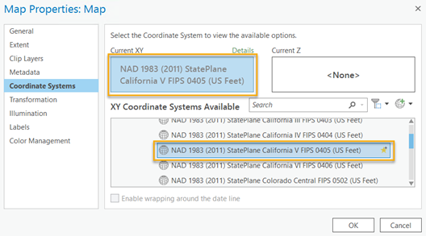
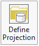
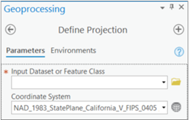
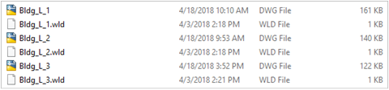
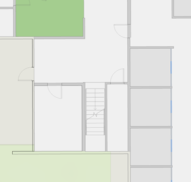
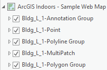
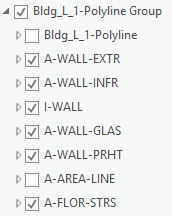

# **TRIRIGA to Indoors ETL -- User Guide**

## July 29, 2021

   

## Table of Contents

- [Audience](#audience)
- [Introduction](#introduction)
  - [How It Works](#how-it-works)
- [Requirements](#requirements)
  - [The Workbench Templates](#the-workbench-templates)
  - [TRIRIGA to Indoors Spatial ETL Tools and Resources](#tririga-to-indoors-spatial-etl-tools-and-resources)
  - [IBM TRIRIGA](#ibm-tririga)
  - [CAD](#cad)
  - [ArcGIS Pro w/Data Interoperability Extension](#arcgis-pro-wdata-interoperability-extension)
- [Workflow](#workflow)
  - [Retrieve TRIRIGA Spec ID's](#retrieve-tririga-spec-ids)
  - [Import Spatial ETL Tools](#import-spatial-etl-tools)
  - [Run "Create TRIRIGA To Indoors Field Mapping Template" Spatial ETL Tool](#run-create-tririga-to-indoors-field-mapping-template-spatial-etl-tool)
  - [Prepare the Import TRIRIGA To Indoors Tool Inputs](#prepare-the-import-tririga-to-indoors-tool-inputs)
     - [Georeference CAD](#georeference-cad)
     - [Analyze CAD](#analyze-cad)
     - [Populate TRIRIGA to Indoors Field Mapping Template](#populate-tririga-to-indoors-field-mapping-template)
     - [Populate CAD Layer Mapping Template](#populate-cad-layer-mapping-template)
     - [Prepare the Target Indoors Geodatabase](#prepare-the-target-indoors-geodatabase)
   - [Run "Import TRIRIGA To Indoors" Spatial ETL Tool](#run-import-tririga-to-indoors-spatial-etl-tool)
 - [Caveats](#caveats)
 - [FAQs](#faqs)
 - [Appendix](#appendix)
   - [Automatically Mapped Fields](#automatically-mapped-fields)
 - [License](#license)

## Audience

This guide is intended for people:

-   familiar with their site
-   with intermediate IBM TRIRIGA experience
-   with intermediate ArcGIS Pro experience

## Introduction

IBM TRIRIGA is an integrated workplace management solution (IWMS) that
includes modules designed to accommodate the needs of operational,
financial and environmental performance. Key features include
environment and energy management, capital project management, lease
accounting and facility management.

***Esri*** has partnered with ***Safe Software*** to create a ***spatial
ETL tool*** to be used with ArcGIS Pro's Data Interoperability extension
to migrate data from ***IBM TRIRIGA*** and associated CAD drawings to
the Indoors Model.

The ETL tool appears in a toolbox in ArcGIS Pro. It extracts basic
floorplan features from CAD drawings attached in TRIRIGA, enriching them
with metadata from TRIRIGA, and outputting to a geodatabase for use in
ArcGIS Indoors. It is unidirectional (TRIRIGA to Indoors).

The following data is processed by the spatial ETL tools:

-   Properties / Sites
-   Buildings / Facilities
-   Floors / Levels
-   Spaces / Units
-   Details
-   Space Groups / Areas
-   Employees, Consultants
    -   People, External Contacts, Visitor Log don't appear to be
        assignable to Spaces

### How It Works

There are 2 spatial ETL tools we use:

1.  Create TRIRIGA To Indoors Field Mapping Template
2.  Import TRIRIGA To Indoors

The **Create TRIRIGA To Indoors Field Mapping Template** spatial ETL
tool queries TRIRIGA's SOAP interface to catalog all the available
business objects and their attributes. The output of this is an Excel
workbook with multiple worksheets. The worksheets allow someone to map
TRIRIGA business object attributes to Indoors feature class attributes.
Each worksheet contains a column with real sample values to aid in
mapping.

The **Import TRIRIGA To Indoors** spatial ETL tool updates an Indoors
geodatabase with CAD data and its matching TRIRIGA record information.
It uses the TRIRIGA to Indoors Field Mapping Template (hereafter "field
map") to map the TRIRIGA attributes to the desired Indoors attributes.
The tool assumes and requires that the CAD files are the ones "attached"
and "synced" using the TRIRIGA CAD Integrator plugin.

The CAD data contains unique TRIRIGA Spec ID's (attached as XDATA
records linked to the AutoCAD entity ID) for each feature that can be
extracted in the spatial ETL tool. These ID's are used to query the
TRIRIGA database for all the TRIRIGA information for each record's
associated CAD features. The CAD data, TRIRIGA record information, and
the field map are used to populate the corresponding records in the
Indoors geodatabase.

If the Indoors geodatabase is empty, the CAD data and TRIRIGA record
information will be loaded directly without needing to compare it. If
the Indoors geodatabase is not empty, the spatial ETL tool will update
the geodatabase with any changes in the TRIRIGA record information and
CAD data since the last successful run. After the first successful run,
a status file (Update_Log.csv file) is created with the run date. This is
stored and expected to be in the same folder as the CAD to Indoors
mapping file. After each successful run, the status file is appended to with
the last run date. It contains one column with the last successful run date/time in ISO format.

In addition to the field map which a user configures, there are internal
mappings that the spatial ETL tool uses in order to automatically map
specific TRIRIGA fields or calculations to specific Indoors fields. See
the appendix for the list of automatically mapped fields.

The data for the People FC only comes from TRIRIGA (i.e. does not come
from CAD). However, a person's assigned Unit is used to create a point
geometry for them. Since there are no sites or facilities in the CAD
files "attached" in TRIRIGA, they are created as an amalgamation of
their sub-feature classes.

## Requirements

### The Workbench Templates

There are a couple FME workbench templates you'll need to download from the [FME Hub](https://hub.safe.com/) shown below. We'll be converting these workbench templates into workbenches later on.

1. Create TRIRIGA To Indoors Field Mapping Template
    - Called "???" in FME Hub
2. Import TRIRIGA To Indoors
    - Called "TRIRIGAtoArcGISIndoors" in FME Hub

### TRIRIGA to Indoors Spatial ETL Tools and Resources

This is a zip file including:

1.  Indoors Geodatabase Template (extended Indoors for TRIRIGA) (indoors-extended.gdb)
2.  Indoors Geodatabase Template (default) (indoors-default.gdb)
3.  TRIRIGA To Indoors Field Mapping Template, populated with extended Indoors fields for TRIRIGA (FieldMapping-extended.xlsx)
4.  TRIRIGA To Indoors Field Mapping Template, populated with default Indoors fields (FieldMapping-default.xlsx)
5.  CAD Layer Mapping Template (default/blank)
6.  Transformation definition file for CSMAP (***WGS_1984\_(ITRF08)\_To_NAD_1983_2011.fme***). This is required for users that have data in NAD83(2011).
    1. Copy this to your Documents\FME\CoordinateSystems folder and restart ArcGIS (and Interop, if open).

### IBM TRIRIGA

-   TRIRIGA Application Platform v3.6.1 or later
-   The CAD drawing files for all floorplans must be attached and published to TRIRIGA using the IBM TRIRIGA CAD Integrator/Publisher software for AutoCAD. The CAD Integrator is its own license on top of a standard module license.
    -   All spaces intended to bring into Indoors included were attached and published with the drawing
    -   TRIRIGA-related layers appear in CAD
        -   triSpaceLayer (Spaces/Units)
        -   triGrossAreaLayer (Floors/Levels)
        -   triMeasuredGrossAreaLayer (Floors/Levels)
        -   triLabelLayer (Spaces/Units labels)
    -   All spaces should have unique labels in the triLabelLayer. Otherwise, a single multi-part record will be created to comprise those with the same label.
-   TRIRIGA application server user account created and granted with admin access for use by the ETL.
-   TRIRIGA application server host URL.

### CAD

-   Exact CAD drawing files mentioned above accessible to the ETL.

### ArcGIS Pro w/Data Interoperability Extension

-   ArcGIS Pro v2.7 or later with access to the TRIRIGA application server
-   Data Interoperability Extension v2.7 or later
-   User licenses:
     -   ArcGIS Pro Advanced named user license (included with a license for ArcGIS Indoors)
          -   This can be named user or single use
     -   Data Interoperability Extension license (included with a license for ArcGIS Indoors)

## Workflow

### Retrieve TRIRIGA Spec ID's

The spatial ETL tools require TRIRIGA Spec ID's for Buildings and Floors so retrieve them.

  1. In TRIRIGA, locate a report that can output a list of all the **buildings** and their Spec ID's (e.g. My Reports, System Reports, title=All Active Locations).
     1. Verify it has the column \"System Record ID (triRecordIdSY)\", otherwise add it.
  2. In TRIRIGA, locate a report that can output a list of all the **floors** and their Spec ID's (e.g. My Reports, System Reports, title=Active Floors).
     1. Verify it has the column \"System Record ID (triRecordIdSY)\", otherwise add it.
  3. Run the reports and download the results as Excel files.
  4. In the reports, take note of the System Record ID's for each **building** and **floor**. These System Record ID's are the Spec ID's used to populate the CAD Layer Mapping Template.

### Import Spatial ETL Tools

  1. Open ArcGIS Pro with user license of ArcGIS Pro Advanced and the Data Interoperability Extension
  2. Create a project, optionally creating a default map.
  3. In Windows Explorer, add the TRIRIGA to Indoors Spatial ETL Tools and Resources zip file to the project folder.
  4. Download the ETL tool workbench templates
     1. Create TRIRIGA To Indoors Field Mapping Template
        1. Go to FME Hub and download "???"
     2. Import TRIRIGA To Indoors
        1. Go to FME Hub and download "[TRIRIGAtoArcGISIndoors](https://hub.safe.com/publishers/safe-lab/templates/tririgatoarcgisindoors)"
  5. Convert each ETL tool workbench template (.fmwt) to a workbench (.fmw). Do this for each file.
     1. Open ArcGIS Pro, go to the Analysis menu, Workflows section, Data Interop submenu, Workbench item
     2. After the Data Interoperability Extension loads, open the workbench template (.fmwt file) and immediately save as a workbench (.fmw) file with the same name. 
  6. In the Pro project, create a new toolbox to contain the ETL tools.
     1. Confirm these steps: In the Catalog pane, in the Project tab, right-click on Toolboxes and choose "New Toolbox". Name is something like "TRIRIGA to Indoors".
  7. In the Pro project, create a spatial ETL tool for each workbench. For each workbench:
     1. Right-click on the new toolbox you created in the previous step, then choose New, Spatial ETL Tool. Fill in the fields below.
        1. Name: (name each workbench as we have, but without spaces, i.e. "CreateTRIRIGAToIndoorsFieldMappingTemplate" or "ImportTRIRIGAToIndoors")
        2. Label: (name each workbench as we have, i.e. "Create TRIRIGA To Indoors Field Mapping Template" or "Import TRIRIGA To Indoors")
        3. Workspace: (pick the .fmw file)
        4. Options:
           1. Import FMW: checked
           2. Store tool with relative path: n/a
  8. When you are finished, you should have a toolbox that looks like this:  

### Run "Create TRIRIGA To Indoors Field Mapping Template" Spatial ETL Tool

This tool will generate the "TRIRIGA to Indoors Field Mapping Template"
Microsoft Excel Workbook. 

**Reminder:** The "TRIRIGA to Indoors Spatial ETL Tools and Resources" zip file contains extended mapping templates that can be directly used instead of following these steps. However, if you've customized your TRIRIGA implementation, you'll instead want to generate and use your own field mapping template by following the steps below.

  1. Locate the "Create TRIRIGA To Indoors Field Mapping Template" tool in the toolbox in the catalog and launch (double-click) it.
  2. Enter the required parameters  
     1. Host URL  
     2. Output Field Mapping Template  
        1. Click the browse icon to choose the path where the generated
            file will be placed. Be sure to give it an extension of
            ".xlsx".  
     3. User Name  
     4. Password
   3. Run the tool. Please be patient as the time this takes varies
    depending on the size of the TRIRIGA system configuration and the
    network connection. Click the "View Details" link at the bottom of
    the tool to launch a dialog where you can see output messages as it
    runs. Once complete, you should see a message stating that the
    mapping template was successfully generated along with statistics
    about which TRIRIGA fields were populated in the mapping template.

### Prepare the Import TRIRIGA To Indoors Tool Inputs

This tool takes these file inputs which need to be prepared:

-   Input Floor Plans (AutoCAD files)
-   Input Field Mapping Template File
-   Input CAD Layer Mapping Template File
-   Target Indoors Geodatabase ***or*** Target Indoors SDE Connection File
    -   Only pick one

The **Input Floor Plans (AutoCAD files)** to be mapped will need to be georeferenced and in a
central location. You'll also need to determine which CAD layers you
want to use for the Details feature class. Note that during the import
process CAD blocks will be exploded into components. This will not
affect the source CAD file.

The **Input Field Mapping Template File** is used to translate TRIRIGA
fields to attributes in the Indoors Model. Fields assigned here take
***priority*** over those assigned in the Input CAD Layer Mapping
Template File.

The **Input CAD Layer Mapping Template File** is used to correlate buildings, floors, spaces, and linework in CAD and TRIRIGA to the Facilities, Levels, Units, Areas, and Details feature classes and tables in the Indoors Model.

  1. For ***Levels***, it uses these columns in the "Level Properties" sheet
     1. name
     2. name_short
     3. description
     4. access_type
     5. level_number
     6. vertical order
     7. elevation_relative
     8. elevation_absolute
     9. height_relative
     10. height_absolute
   2. For ***Details***, it uses the "DETAILS" column in the "CAD Layer to FC Mapping" sheet to choose the CAD layers used
   3. For ***Facilities***, it supplies these columns in the "Facility Properties" sheet
      1. facility_number
      2. name
      3. name_long
      4. description
      5. date_built
      6. elevation information that is neither in the CAD file nor TRIRIGA
         1. elevation_relative
         2. elevation_absolute
         3. height_relative
         4. height_absolute
      7. rotation

The **Target Indoors Geodatabase** is an ***existing*** file geodatabase. You can use
the default or extended Indoors Geodatabase Templates as a starting
point to create this. You may use this input or the "Target Indoors SDE Connection File" input, but not both.

The **Target Indoors SDE Connection File** is a connection file used by
ArcGIS Pro to connect to an Enterprise Geodatabase. You'll use this if
your target geodatabase is an Enterprise geodatabase as opposed to a
file geodatabase. You may use this input or the "Target Indoors Geodatabase" input, but not both.

#### Georeference CAD

You'll need to georeference the CAD drawings, populate the 2 mapping templates, then prepare the Target Indoors Geodatabase before use.

Georeferencing is the process of spatially adjusting a CAD drawing without changing the original source data. CAD floorplan drawings typically do not come georeferenced (i.e. no real-world X/Y/Z location).

  1. Add a new map to your ArcGIS Pro project.
  2. Change the coordinate system of the map. Right-click on Map in the Contents pane and select Properties.
  3. Under Coordinate Systems, change the CurrentXY Coordinate System to an appropriate coordinate system for your site.  

  4. Add the first floor CAD drawing from your desired facility to the map. In the \"Map\" tab, \"Layer\" group, click the \"Add Data\" button, then choose the CAD file.
  5. Select one of the CAD layers in the Contents pane. The CAD Layer Manage tab appears. Click it.
  6. Using the Define Projection tool in the CAD Layer tab, assign the CAD layer the same coordinate system you just specified for your map. Run the tool. The output is a .prj file in the same file location as your CAD drawing.  
  

  7. To assign the same coordinate system to all your CAD drawings, you can create a universal projection file. To do this, save and close your ArcGIS Pro project. Go to File Explorer, open the folder containing your CAD drawings and rename the .prj you created in the previous step to **esri_cad.prj**. This will assign every un-projected CAD drawing in your folder the same coordinate system. 
  8. Open your ArcGIS Pro project again.
  9. With a CAD layer selected, navigate to the CAD Layer tab and select Georeference. This contains tools that allow you to move, scale, rotate, and add control points. Use these tools as needed to scale and position your drawing.
  10. Once positioned, hit Save. This action creates a .wld file with the same name and location as your .dwg file. This file stores coordinates, allowing ArcGIS Pro to generate the floorplan automatically with the correct scale and position when re-opening it in a map. Georeferencing in ArcGIS Pro does not edit the CAD drawing.
  11. To give the rest of the floorplans in your facility the same scale and position, create a copy of the .wld from the last step for every level in your facility and rename them so that each .dwg has an accompanying .wld.  

  12. Optionally, to give all the CAD files in your folder the same scale, position, and rotation, you can instead create a _universal world file_. A universal world file defines the control points for all CAD datasets in the same folder that have not already been georeferenced. Rename the .wld that you created to **esri_cad.wld**. 
  13. Add the rest of your floorplans in ArcGIS Pro and verify that all floors within a facility line up properly by inspecting CAD features that remain consistent throughout all floors, such as stairways and elevator shafts. The floorplans may not line up depending on how the CAD drawings were authored. If the files do not line up, use the georeferencing tools to move the files appropriately.

For more information on georeferencing in ArcGIS Pro, please see the [online documentation](https://pro.arcgis.com/en/pro-app/latest/help/data/cad/georeferencing-cad-data.htm).

#### Analyze CAD

CAD files come with many layers, some of which you'll want to use in the
Details feature class. The Details feature class contains line work
which provides context to your Indoor map and typically includes walls,
windows, doors, elevator shafts, stair treads, furniture, etc.

You'll need to know the layer names that these line features are on. If
you are unfamiliar with the drawing, you'll need to open it in ArcGIS
Pro or your preferred drawing editor to determine them. In ArcGIS Pro,
when first adding CAD to a map, layer types are grouped, for example:

The layers you'll want are in the ***polyline*** type group, for example:

Write down these names for use later in populating the **CAD Layer
Mapping Template**.

#### Populate TRIRIGA to Indoors Field Mapping Template

This template contains information for mapping desired fields in TRIRIGA
to ArcGIS Indoors. It is an Excel workbook containing these worksheets
which relates to the corresponding Indoors feature classes:

-   **Sites** Field Map
-   **Facilities** Field Map
-   **Levels** Field Map
-   **Units** Field Map
-   **People** Field Map

Each worksheet contains these columns:

-   Esri Indoor Field
-   TRIRIGA Field
-   Sample TRIRIGA Field Value

For each row you'd like to map, populate its **Esri Indoor Field** cell
with the attribute for the related feature class. Figure 1 below depicts some common
mappings. These are standard TRIRIGA fields, but their names may vary in
your organization's TRIRIGA system. Note that if you'd like to use the
same TRIRIGA field for multiple Indoors fields, you can simply
copy/paste that row and assign another Indoor field. For example, see
below where the **Site** sheet's Indoors fields **NAME** and
**NAME_LONG** *both* map to the TRIRIGA field
**Site.RecordInformation.triNameTX**.

Note that fields mapped in the **TRIRIGA to Indoors Field Mapping Template** workbook take priority over those specified in the **CAD Layer Mapping Template** workbook, *except* these so there is no need to
map them there (they'll be ignored) as they are automatically mapped to the associated TRIRIGA record's Spec ID:

-   SITE_ID
-   FACILITY_ID
-   LEVEL_ID
-   UNIT_ID

  ---------- ------------------ ------------------------------------------
  ***Figure 1***
 | Sheet      | Esri Indoor Field | Tririga Field                                         |
|------------|-------------------|-------------------------------------------------------|
| Sites      | ADDRESS           | Site.RecordInformation.triAddressTX                   |
| Sites      | AREA_UM           | Site.RecordInformation.triAreaUO                      |
| Sites      | SOURCE_NAME       | Site.RecordInformation.triBusinessObjectNameSY        |
| Sites      | LOCALITY          | Site.RecordInformation.triCityTX                      |
| Sites      | COUNTRY           | Site.RecordInformation.triCountryTX                   |
| Sites      | DESCRIPTION       | Site.RecordInformation.triDescriptionTX               |
| Sites      | CONTACT_PHONE     | Site.RecordInformation.triMainPhoneTX                 |
| Sites      | NAME              | Site.RecordInformation.triNameTX                      |
| Sites      | NAME_LONG         | Site.RecordInformation.triNameTX                      |
| Sites      | SOURCE_PATH       | Site.RecordInformation.triPathTX                      |
| Sites      | PROVINCE          | Site.RecordInformation.triStateProvTX                 |
| Sites      | POSTAL_CODE       | Site.RecordInformation.triZipPostalTX                 |
| Facilities | ADDRESS           | Building.RecordInformation.triAddressTX               |
| Facilities | AREA_UM           | Building.RecordInformation.triAreaUO                  |
| Facilities | SOURCE_NAME       | Building.RecordInformation.triBusinessObjectNameSY    |
| Facilities | LOCALITY          | Building.RecordInformation.triCityTX                  |
| Facilities | COMMON_NAME       | Building.RecordInformation.triCommonNameTX            |
| Facilities | COUNTRY           | Building.RecordInformation.triCountryTX               |
| Facilities | DESCRIPTION       | Building.RecordInformation.triDescriptionTX           |
| Facilities | AREA_GROSS        | Building.RecordInformation.triGrossAreaNU             |
| Facilities | LEGAL_NAME        | Building.RecordInformation.triLegalNameTX             |
| Facilities | CONTACT_PHONE     | Building.RecordInformation.triMainPhoneTX             |
| Facilities | NAME              | Building.RecordInformation.triNameTX                  |
| Facilities | SITE_NAME         | Building.RecordInformation.triParentPropertyTX        |
| Facilities | SOURCE_PATH       | Building.RecordInformation.triPathSY                  |
| Facilities | AREA_RENTABLE     | Building.RecordInformation.triRentableAreaNU          |
| Facilities | PROVINCE          | Building.RecordInformation.triStateProvTX             |
| Facilities | AREA_USABLE       | Building.RecordInformation.triUsableAreaNU            |
| Facilities | AREA_NET          | Building.RecordInformation.triUsableAreaNU            |
| Facilities | POSTAL_CODE       | Building.RecordInformation.triZipPostalTX             |
| Facilities | USE_TYPE          | Classification.Classified by triBuildingClass.Name    |
| Levels     | AREA_UM           | Floor.RecordInformation.triAreaUO                     |
| Levels     | SOURCE_NAME       | Floor.RecordInformation.triBusinessObjectNameSY       |
| Levels     | AREA_GROSS        | Floor.RecordInformation.triGrossAreaImpNU             |
| Levels     | NAME              | Floor.RecordInformation.triNameTX                     |
| Levels     | SOURCE_PATH       | Floor.RecordInformation.triPathTX                     |
| Levels     | AREA_RENTABLE     | Floor.RecordInformation.triRentableAreaNU             |
| Levels     | AREA_USABLE       | Floor.RecordInformation.triUsableAreaNU               |
| Levels     | AREA_NET          | Floor.RecordInformation.triUsableAreaNU               |
| Levels     | FACILITY_NAME     | Location.Parent Building.Name                         |
| Levels     | SITE_NAME         | Location.Parent Property.Name                         |
| Units      | USE_TYPE          | Classification.Classified by Space Class Current.Name |
| Units      | FACILITY_NAME     | Location.Parent Building.Name                         |
| Units      | LEVEL_NAME        | Location.Parent Floor.Name                            |
| Units      | SITE_NAME         | Location.Parent Property.Name                         |
| Units      | AREA_GROSS        | Space.RecordInformation.triAreaNU                     |
| Units      | AREA_UM           | Space.RecordInformation.triAreaUO                     |
| Units      | SOURCE_NAME       | Space.RecordInformation.triBusinessObjectNameSY       |
| Units      | CAPACITY          | Space.RecordInformation.triCapacityNU                 |
| Units      | DESCRIPTION       | Space.RecordInformation.triDescriptionTX              |
| Units      | NAME              | Space.RecordInformation.triNameTX                     |
| Units      | NAME_LONG         | Space.RecordInformation.triNameTX                     |
| Units      | OCCUPANCY_STATUS  | Space.RecordInformation.triOccupancyStatusCL          |
| Units      | SOURCE_PATH       | Space.RecordInformation.triPathSY                     |
| Units      | UTILIZATION       | Space.RecordInformation.triTotalHeadcountNU           |
| Units      | AREA_NET          | Space.RecordInformation.triUsableAreaNU               |
| Units      | ASSIGNABLE        | Space.triCurrentSpaceClass.triAssignableBL            |
| Units      | BOMA_TYPE         | Space.triCurrentSpaceClass.triBOMATypeLI              |
| Units      | BUILDING_COMMON   | Space.triCurrentSpaceClass.triBuildingCommonBL        |
| Units      | EXTERIOR_GROSS    | Space.triCurrentSpaceClass.triExteriorGrossBL         |
| Units      | FLOOR_COMMON      | Space.triCurrentSpaceClass.triFloorCommonBL           |
| Units      | INTERIOR_GROSS    | Space.triCurrentSpaceClass.triInteriorGrossBL         |
| Units      | OSCRE_CODE        | Space.triCurrentSpaceClass.triOSCRECodeTX             |
| Units      | OSCRE_STANDARD    | Space.triCurrentSpaceClass.triOSCREStandardBL         |
| Units      | PROPERTY_COMMON   | Space.triCurrentSpaceClass.triPropertyCommonBL        |
| Units      | RENTABLE          | Space.triCurrentSpaceClass.triRentableBL              |
| Units      | USABLE            | Space.triCurrentSpaceClass.triUsableBL                |
| Units      | VACANT_COMMON     | Space.triCurrentSpaceClass.triVacantCommonBL          |
| People     | COST_CENTER       | People.Detail.triCostCenterTX                         |
| People     | EMAIL             | People.Detail.triEmailTX                              |
| People     | FIRSTNAME         | People.Detail.triFirstNameTX                          |
| People     | LASTNAME          | People.Detail.triLastNameTX                           |
| People     | KNOWNAS           | People.Detail.triNameTX                               |
| People     | REPORTS_TO        | triPeople.Reports To.Name                             |
| People     | CONTACT_PHONE     | People.Detail.triWorkPhoneTX                          |
| People     | ORG_LEVEL_1       | Organization.Primary Organization.Name                |
  ---------- ------------------ ------------------------------------------

#### Populate CAD Layer Mapping Template

This template contains information for mapping desired CAD drawings
attached in TRIRIGA to ArcGIS Indoors, specifically:

-   Buildings / Facilities
-   Floors / Levels
-   Spaces / Units
-   Details

It is an Excel workbook containing these worksheets which relates to the
corresponding Indoors feature classes:

-   CAD Layer to FC Mapping
-   Facility Properties
-   Level Properties

Each worksheet contains columns specific to their mapping (translation)
requirements as shown below.

- **CAD Layer to FC Mapping** sheet with the columns below. *The columns **not mentioned below** are mapped automatically to the "tri" CAD layers so do not need to be populated in this sheet.*
    - DETAILS
        - Add a row for each CAD layer to be added to the Details
            feature class, for example:
            -   A-DOOR
            -   A-GENM
            -   A-WALL-EXTR
            -   A-WALL-INT
            -   A-WALL-GLAS
            -   A-COLS
            -   A-STAIRS
            -   A-EVTR

- **Facility Properties** sheet with the columns below. Add a row for each building/facility. The columns below will be added to the Facilities feature class, but the contents may be overridden using the TRIRIGA to Indoors Field Mapping Template. The columns that exist in this sheet, ***but not mentioned below*** are ignored so do not need to be populated in this sheet.

    - FACILITY_ID
        - A unique identifier string for the facility, 50 characters or less.
        - Set to the TRIRIGA Building Spec ID captured previously in the TRIRIGA report.
    - FACILITY_NUMBER
        - Unique identifier integer for the facility.
    - NAME
        - Short name for the facility, 100 characters or less.
    - NAME_LONG
        - Short name for the facility, 255 characters or less.
    - DESCRIPTION
        - Description for the facility, 255 characters or less.
    - DATE_BUILT
        - Date the facility was built in Date format.
    - ELEVATION_RELATIVE
        - The Z value of the base of the facility in meters, relative to a flat terrain surface. (typically 0)
    - ELEVATION_ABSOLUTE
        - The absolute Z value of the base of the facility in meters, relative to sea level.
    - HEIGHT_RELATIVE
        - The maximum height of the facility in meters, relative to a flat terrain surface.
    - HEIGHT_ABSOLUTE
        - The maximum height of the facility in meters, relative to sea level. (e.g. a 100-meter tall facility with an absolute elevation of 350 meters has an absolute height of 450 meters). 
    - ROTATION
        - The geographic rotation (left/west = 0 advancing clockwise) of the facility. Valid value range: 0-180. Used for network creation.
        - If this isn't specified, it will be calculated.

- **Level Properties** tab with the columns below. Add a row for each floor/level. The columns below will be added to the Facilities feature class, but the contents may be overridden using the TRIRIGA to Indoors Field Mapping Template. The columns that exist in this sheet, ***but not mentioned below*** are ignored so do not need to be populated in this sheet.

    - LEVEL_ID
        - A unique identifier string for the level, 50 characters or less.
        - Set to the TRIRIGA Floor Spec ID captured previously in the TRIRIGA report.
    - NAME
        - The common name of the level (e.g. Floor 1), 255 characters or less.
    - NAME_SHORT
        - The short name of the level (e.g. 1), 4 characters or less.
    - DESCRIPTION
        - Description for the facility, 255 characters or less.
    - ACCESS_TYPE
        - The access type of the level (e.g. Visitor, Employee, Public), 50 characters or less.
    - LEVEL_NUMBER
        - An integer representing the level number for the level (e.g. 1).
    - VERTICAL_ORDER
        - An ordinal integer representing the vertical order of each level (e.g. 0).
    - ELEVATION_RELATIVE
        - The Z value of each level in meters, relative to a flat terrain surface. (e.g. Floor 1 = 0, Floor 2 = 4.25, etc.).
    - ELEVATION_ABSOLUTE
        - The absolute Z value of each level in meters, relative to sea level. (e.g. Floor 1 = 254, Floor 2 = 258.25, etc.).
    - HEIGHT_RELATIVE
        - The maximum height of the top of the level in meters, relative to the bottom of the level. (e.g. Floor 1 = 4.25, Floor 2 = 4.25, etc.).
    - HEIGHT_ABSOLUTE
        - The absolute maximum height of the level in meters, relative to sea level. (e.g. Floor 1 = 258.25, Floor 2 = 262.5, etc.).

#### Prepare the Target Indoors Geodatabase

The ***Indoors Geodatabase Template (extended)*** provided is based off the standard Indoors Model, but enriched with TRIRIGA related fields. You can modify it as needed to meet your organization's needs so long as the standard Indoors fields are retained. If you would like to use the standard Indoors Model, use the ***Indoors Geodatabase Template (default)*** provided. See [here](https://pro.arcgis.com/en/pro-app/latest/help/data/indoors/arcgis-indoors-information-model.htm) for more information on the standard Indoors fields.

  1. Make a copy of the Indoors Geodatabase Template, naming it as you like for use as your working file geodatabase.
  2. Optionally customize the working file geodatabase, keeping these notes in mind:
      1. Do not remove, rename, or change configuration of any of the standard Indoors
           1. domains
           2. datasets
           3. feature classes
           4. tables
           5. fields
      2. You may add new domains, datasets, feature classes, tables, and fields.
      3. For any fields that you remove or add, remember to adjust the mapping in the **TRIRIGA to Indoors Field Mapping Template** appropriately.
  3. Place the working file geodatabase in your ArcGIS Pro project directory (not covered here).

### Run "Import TRIRIGA To Indoors" Spatial ETL Tool

This tool will update the target ArcGIS Indoors geodatabase.

  1. Locate the "Import TRIRIGA to Indoors" tool in the newly imported toolbox in the catalog and launch (double-click) it.
  2. Enter the required parameters:
      1. Input Floor Plans
      2. Input Field Mapping Template File
         1. Click the browse icon to choose the path where the file generated by the "Create TRIRIGA to Indoors Field Mapping Template" tool is located.
      3. Input CAD Layer Mapping Template File
         1. Click the browse icon to choose the path where the file is located.
      4. Host URL
      5. User Name
      6. Password
      7. Rebuild Facilities from Levels
         1. This will rebuild the geometries of the modified/added facilities based on the geometries of their levels
      8. Rebuild Sites from Facilities
         1. This will rebuild the geometries of the modified/added sites based on the geometries of their facilities
      9. Target Indoors Geodatabase
         1. Select the target file geodatabase to update (if you don't select an enterprise geodatabase below)
      10. Target Indoors SDE Connection File
          1. Select the target Enterprise geodatabase to update (if you don't select a file geodatabase above) 
  3. Run the tool. Please be patient as the time this takes varies depending on the size of the TRIRIGA system configuration and your network connection. Once complete, you should see a message stating that the translation was successful along with statistics about features written to the geodatabase.

#### 

## Caveats

-   In Indoors, the People feature class's EMAIL field must be unique, but this may not be a requirement of TRIRIGA.
-   The ETL creates an inner and outer source type for each level leaving multiple levels with the same level_id. The Indoors network tools (e.g. Generate Indoor Pathways) require unique level_id\'s and they do not honor definition queries as of ArcGIS Pro 2.7. Here is a workaround to perform after the Indoors is populated and before you use the Generate Indoor Pathways geoprocessing tool:
    1. Optionally make a backup of the Levels feature class  
        1. Make a copy of the Levels feature class in the Indoors feature dataset and rename the copy as "LevelsBackup". Change its alias to "LevelsBackup" to avoid confusion if ever added to the map.  
    2.   Delete all Level features where SOURCE_TYPE = "Inner".
    3.   Run the Generate Indoor Pathways tool choosing "Levels" for the
        "Input Level Features" parameter as usual.

## FAQs

### Does the ETL user account have access to sensitive information?
Yes. It has full administrative rights so can read everything in the system including account passwords, however account passwords are prevented from being mapped and displayed in the ETL in any way by default.

## Appendix

### Automatically Mapped Fields

Below are some automatically mapped fields. In addition to these, parent ID's will be automatically mapped as well.

  1. TRIRIGA Spec ID mapped to the unique ID (e.g. SITE_ID) and in the TRIRIGA_SPEC_ID field in the ***Indoors Geodatabase Template (extended Indoors for TRIRIGA)*** for applicable FCs/Tables.
  2. Calculated:
      1. FACILITIES:
         1. ROTATION
         2. LEVELS_ABOVE_GROUND
         3. LEVELS_TOTAL
      2. DETAILS:
         1. DETAIL_ID = LEVEL_ID + \".Details.\" + str(counter + 10000)
      3. PEOPLE:
         1. (various location fields)
         2. AREA_ID: Populated with the TRIRIGA Spec ID for their primary/secondary location space group if assigned one.
      4. UNITS:
         1. AREA_ID: Populated with the TRIRIGA Spec ID for their space group if assigned one. In this case, all other location fields will be NULL.
         2. ASSIGNMENT_TYPE:
             1. "hotel" if a space is all of these
                 1. assignable
                 2. part of an area (has AREA_ID)
             2. "none" if a space is all of these
                 1. assignable
                 2. not part of an area
                 3. not assigned to a person (i.e. No People have UNIT_ID set to the Unit) (future support)
             3. "office" if a space is all of these (future support)
                 1. assignable
                 2. not part of an area
                 3. assigned to a person (i.e. any People have UNIT_ID set to the Unit)
             4. "not assignable" if a space is
                 1. not a hotel or none above (implies not assignable, but not checked specifically)
         3. ASSIGNABLE: Set to a space's TRIRIGA's triCurrentSpaceClass.triAssignableBL (extended geodatabase only)
      5. AREAS:
         1. AREA_ID: Populated with the TRIRIGA Spec ID for the space group
         2. AREA_NAME: Populated with TRIRIGA's space group name (RecordInformation.triNameTX)
         3. AREA_TYPE: "hotel"

## License
Copyright © 2021 Esri  

Licensed under the Apache License, Version 2.0 (the "License"); you may not use this file except in compliance with the License. You may obtain a copy of the License at  
> http://www.apache.org/licenses/LICENSE-2.0  

Unless required by applicable law or agreed to in writing, software distributed under the License is distributed on an "AS IS" BASIS, WITHOUT WARRANTIES OR CONDITIONS OF ANY KIND, either express or implied. See the License for the specific language governing permissions and limitations under the License.  

A copy of the license is available in the repository's [LICENSE](./license.txt) file.

